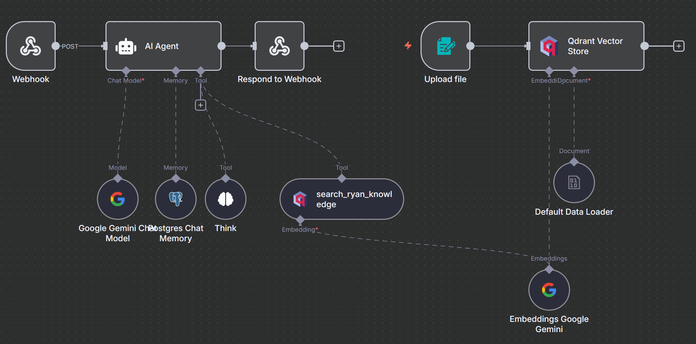

# Ryan Le AI Chatbot

An intelligent AI assistant that provides information about my professional background through advanced vector search and knowledge retrieval.

## **[Chat with my AI assistant](https://chatbot.ryanle.ca/)**



## Features

- **Knowledge-Based Responses**: Vector search across curated knowledge base
- **Persistent Memory**: Conversation history maintained across sessions
- **File Upload Support**: Can process and learn from uploaded documents
- **Mobile Responsive**: Optimized for all devices
- **Fast & Accurate**: Gemini with Qdrant vector search

## Technical Architecture

```
Chat Interface → AI Agent → Vector Search → Knowledge Base
                     ↓
               Postgres Memory ← Gemini
```

### Core Components

- **AI Model**: Google Gemini 2.5 Flash
- **Vector Database**: Qdrant for semantic search
- **Embeddings**: Google Gemini for document vectorization
- **Memory**: PostgreSQL for conversation persistence
- **Platform**: n8n workflow automation

### Workflow Structure

1. **Chat Trigger**: Receives user messages via webhook
2. **AI Agent**: Processes queries with knowledge search
3. **Vector Search**: Semantic search across knowledge base
4. **Memory System**: Maintains conversation context
5. **Response Generation**: Contextual, accurate responses

## Configuration

### System Prompt Strategy

- **Search-First Approach**: Always searches knowledge base for queries
- **Concise Responses**: Under 100 words for most queries
- **Accurate Information**: Only uses verified knowledge base content
- **Context-Aware**: Maintains conversation flow with memory

### Vector Search Settings

- **Top-K Results**: 8 most relevant documents per query
- **Semantic Matching**: Google Gemini embeddings
- **Dynamic Retrieval**: Adjusts based on query complexity

## Advanced Features

- **File Upload Processing**: Can learn from new documents
- **Conversation Memory**: Persistent across sessions
- **Error Handling**: Graceful fallbacks for edge cases
- **Performance Optimized**: Fast response times
- **Knowledge Updates**: Easy addition of new information

## Self-Hosted Infrastructure

Running on personal homelab with:

- Docker containerization
- n8n workflow orchestration
- PostgreSQL database
- Qdrant vector storage
- Custom domain and SSL

## Usage

Visit the chat interface to learn more about my professional background, technical skills, and experience. The AI assistant will provide detailed, accurate responses based on my curated knowledge base.

---

_This project demonstrates AI integration, vector search implementation, and modern web interface design._
